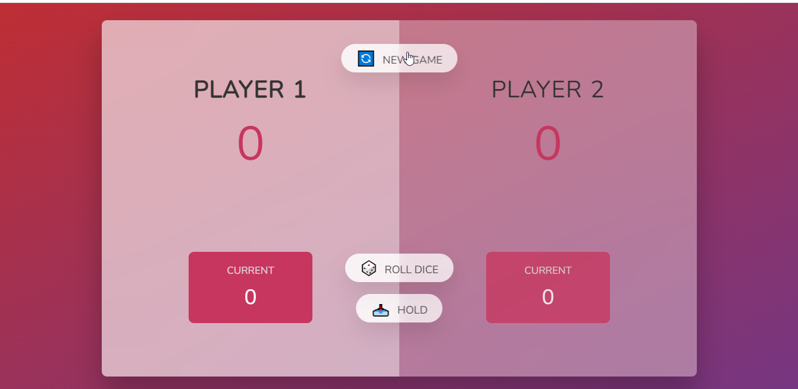

#  PIG GAME

## Table of contents

- [Overview](#overview)
  - [The challenge](#the-challenge)
  - [Screenshot](#screenshot)
- [My process](#my-process)
  - [Built with](#built-with)
- [Author](#author)

## Overview
Pig Game if a fun and easy game which can be played between two people.

HOW IT WORKS

    The rule of this Game is to NOT roll "1" on the dice

    - Each player can keep on Rolling the dice and keep increasing your current score, until you roll the Number 1
    

WHAT HAPPENS WHEN YOU ROLL "1" ?

    -When a player rolls the number "1", you immediately lose all the points in your current score and the next player becomes the active Player.

HOW TO AVOID LOSING ALL YOUR POINTS ?

    - To avoid losing all your points, A player can click on "Hold".
    - This will immediately add your current score to your Total Score,  and the next player becomes the active Player.

HOW TO WIN ?😎

    A player is declared the winner when he has a Total score of 100.

### Screenshot

## My process

### Built with

- Semantic HTML5 markup
- CSS custom properties
- CSS Grid
- Mobile-first workflow
- JavaScript
- Jquery

## Author

- [Henry Elebor]